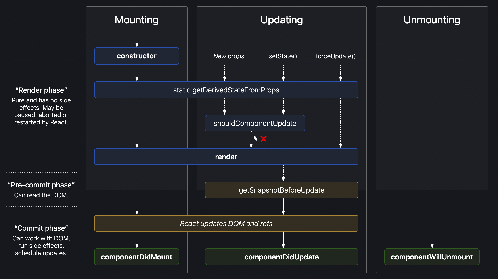

# Intro...
리액트의 lifecycle은 세 단계로 구분할 수 있다.
<figure>


<figcaption>출처: https://projects.wojtekmaj.pl/react-lifecycle-methods-diagram/
</figcaption>
</caption>
</figure>

<br>

`Mounting -> Updating -> Unmounting`
리액트의 각 컴포넌트들은 모두 위의 라이프사이클을 따른다. 우리는 `lifecycle method`를 이용하여 라이프사이클의 특정 단계에서 원하는 코드를 실행하도록 할 수 있다.

- `Mounting`는 돔에 요소들을 넣는 단계다.
- `Updating`는 말 그대로 컴포넌트가 업데이트 되는 단계다.
- `Unmounting`는 돔에서 컴포넌트가 제거되는 단계다.

자세히 살펴보자.

# Mounting
컴포넌트의 인스턴스가 생성이 되고 돔에 삽입될 때, 아래의 `lifecycle method`들은 다음과 같은 순서로 호출이 된다.

(굵은 글씨의 함수가 자주 쓰이는 함수다.)
<ol>
<li><b>constructor()</b></li>
<li>static getDerivedStateFromProps()</li>
<li><b>render()</b></li>
<li><b>componentDidMount()</b></li>
</ol>

> ⚠️주의<br>UNSAFE_componentWillMount() 함수는 legacy code로 여겨지고 있기 때문에 지양된다.

render()함수는 필수고 항상 호출되며, 나머지 함수들은 선택사항이다.

## constructor() : mount 전에 호출
- constuctor()함수는 컴포넌트가 생성될 때 제일 먼저 호출된다.

- constructor()메서드는 인자인 props와 함께 호출되기 때문에 내부에 제일 먼저 `super(props)`를 선언해주어야 한다. `super(props)`는 부모 컴포넌트의 constructor method를 생성해주고, 컴포넌트가 부모 컴포넌트로부터 상속받게 해준다. 

- 대표적으로 아래 두 가지의 목적으로 쓰인다. 
    - 초기 local state, 초기 value을 세팅
        - state는 객체로 할당이 된다. 
    - 인스턴스에 event handler를 binding

- constructor()안에서 초기 값을 세팅하거나 event handler를 bind할 땐, setState함수를 사용하지 않고 직접 할당을 한다.

    state를 직접 할당할 수 있는 유일한 곳이다.
    ```
    constructor(props) {
    super(props);
    // Don't call this.setState() here!
    this.state = { counter: 0 };
    this.handleClick = this.handleClick.bind(this);
    }
    ```
- local state가 필요없거나 method를 bind할 필요 없다면 constructor()를 구현 할 필요가 없다. (optional)
- constructor()안에서 side-effects를 발생시키거나 subscriptions을 하지 않는다. (componentDidMount()에서 진행한다)

```
constructor(props) {
 super(props);
 // Don't do this!
 this.state = { color: props.color };
}
```
- 위 코드의 잘못된 점 
    - props.color를 직접 this.props.color로 사용하면 된다.
    - props가 state에 반영되기 전에 color를 update하려고 해 버그가 난다.
    - update되지 않는 color의 초기값을 할당하고 싶을 때만, intialColor 등의 이름으로 사용한다. 초기값으로 reset할 때 사용.

## componentDidMount() : mount된 직후
- tree에 컴포넌트가 삽입되자마자 즉, mount되자마자 호출된다.
- 데이터를 로드해야 된다면 네트워크 요청하기 좋은 곳이다.
- 구독하기도 좋은 곳이다. 구독했으면 componentWillUnmount()에서 구독해제하는 것도 잊지 말자!
- 여기서 setState()하게 되면 렌더링을 두 번 요청하게 되더라도 아직 브라우저는 스크린에 업데이트 하기 전이므로 사용자는 즉시 업데이트 된 페이지를 보게 된다.

# Updating
컴포넌트는 컴포넌트의 `state`나 `props`에 변화가 생길 때 업데이트 된다.

다음과 같은 순서로 업데이트 된다

<ol>
<li>getDerivedStateFromProps()</li>
<li>shouldComponentUpdate()</li>
<li>render()</li>
<li>getSnapshotBeforeUpdate()</li>
<li>componentDidUpdate()</li>
</ol>

마찬가지로 render()는 필수적으로 요구되며 나머지 함수들은 optional이다.

## [rarely used] static getDerivedStateFromProps
- 업데이트 시 최초로 호출되는 함수다.
- 업데이트 된 객체를 반환하거나 업데이트 된 부분이 없으면 null을 반환한다. 
- initial props를 state에 세팅하기 좋은 장소다.
```
class Header extends React.Component {
  constructor(props) {
    super(props);
    this.state = {favoritecolor: "red"};
  }
  static getDerivedStateFromProps(props, state) {
    return {favoritecolor: props.favcol };
  }
  changeColor = () => {
    this.setState({favoritecolor: "blue"});
  }
  render() {
    return (
      <div>
      <h1>My Favorite Color is {this.state.favoritecolor}</h1>
      <button type="button" onClick={this.changeColor}>Change color</button>
      </div>
    );
  }
}

ReactDOM.render(<Header favcol="yellow"/>, document.getElementById('root'));
```
버튼을 누르면 changeColor함수가 호출되면서 favoritecolor가 blue로 변경되는 업데이트가 일어나고, 그 직후 getDerivedStateFromProps함수가 호출되기 때문에 favoritecolor는 props로 받은 yellow로 렌더링 된다.
- props를 받아서 데이터 페칭하거나 애니메이션 효과를 주는 등의 side effect를 원한다면 componentDidUpdate()에서 하는 게 좋다.
## [rarely used] shouldComponentUpdate()
- shouldComponentUpdate(nextProps, nextState)

- 리액트가 렌더링을 계속 해야 하는지의 여부를 boolean값으로 반환한다.
- 더 구체적으로 말하면 컴포넌트의 출력(페이지)이 현재 state나 props의 변화에 영향을 받았는지 여부다.
- 기본적으로는 모든 state가 변할 때마다 리렌더가 일어난다.
- 새로운 props나 state를 받았을 때 렌더링 전에 함수가 호출이 되며, 초기렌더링이나 forceUpdate()시에는 호출되지 않는다. 
- 렌더링을 방지하기 위해 쓰면 버그를 일으킬 수 있고, 오직 성능 최적화를 위해 쓴다.
- 직접 이 메서드를 작성하기보다 내장된 pureComponent(얕은 비교로 shouldComponentUpdate()가 구현되고 필요한 업데이트를 뛰어넘을 확률을 줄여줌)를 쓰는 걸 추천한다.
- 이 메서드가 false를 반환하면 뒤의 UNSAFE_componentWillUpdate(), render(), and componentDidUpdate()는 호출되지 않는다.


## render()
- 업데이트 시 새로운 변경사항과 함께 HTML을 DOM에 다시 렌더링 합니다.

## [rarely used] getSnapshotBeforeUpdate
- 업데이트 전에 props와 state 값에 접근할 수 있는 함수입니다.
- 말인 즉슨, 업데이트가 일어난 후에도 업데이트 전의 값을 확인할 수 있습니다.
- componentDidUpdate()와 같이 써야 합니다. 안 그럼 에러 발생!
- 아래와 같이 사용합니다.
```
class Header extends React.Component {
  constructor(props) {
    super(props);
    this.state = {favoritecolor: "red"};
  }
  componentDidMount() {
    setTimeout(() => {
      this.setState({favoritecolor: "yellow"})
    }, 1000)
  }
  getSnapshotBeforeUpdate(prevProps, prevState) {
    document.getElementById("div1").innerHTML =
    "Before the update, the favorite was " + prevState.favoritecolor;
  }
  componentDidUpdate() {
    document.getElementById("div2").innerHTML =
    "The updated favorite is " + this.state.favoritecolor;
  }
  render() {
    return (
      <div>
        <h1>My Favorite Color is {this.state.favoritecolor}</h1>
        <div id="div1"></div>
        <div id="div2"></div>
      </div>
    );
  }
}

ReactDOM.render(<Header />, document.getElementById('root'));
```

## componentDidUpdate()
- componentDidUpdate(prevProps, prevState, snapshot)
- DOM에 update가 되자 마자 호출된다. 최초 렌더링 시에는 호출X
- 어떤 값의 변화에 따라 네트워크 요청을 해야할 때 쓴다.
```
componentDidUpdate(prevProps) {
  // Typical usage (don't forget to compare props):
  if (this.props.userID !== prevProps.userID) {
    this.fetchData(this.props.userID);
  }
}
```
- 여기서 setState를 할 땐, 꼭 조건문으로 감싸야 한다. 안그럼 무한 루프에 빠진다.
- 또 추가적으로 리렌더링을 발생시키기 때문에 유저에게 영향은 없더라도 퍼포먼스에 영향을 줄 수 있다.
- shouldComponentUpdate() 가 false를 반환하면 호출되지 않는다.

# Unmounting
위에서 말했듯이, DOM에 컴포넌트가 제거되는 단계입니다.

마운트가 해제될 때 호출될 수 있는 메서드가 componentWillUnmount 하나입니다.

## componentWillUnmount
- 컴포넌트가 DOM에서 제거되려고 하기 직전에 호출됩니다.
- 타이머를 무효화 하거나 네트워크 요청을 취소하거나 또는, componentDidMount()에서 만든 구독을 해제하는 등의 필수적인 cleanup을 여기서 구현하면 됩니다.
- 여기서 setState는 하지 마세요. 리렌더링 절대 안됩니다. 컴포넌트 인스턴스가 한 번 언마운트 되면 다시는 마운트되지 않습니다.
